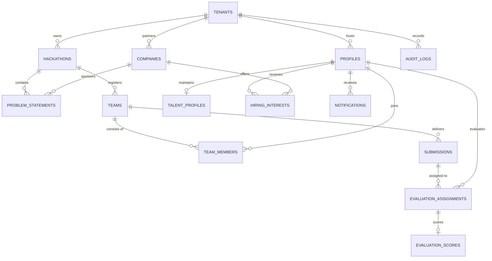

# HackBridge — Enterprise Multi-Tenant Hackathon & Talent SaaS Platform
## Complete Technical Documentation & System Manual

**Pilot Institution:** Maharaja Institute of Technology Thandavapura (MITT), Mysuru  
**Version:** 2.0.0 (100% Full Specification Parity — Phases 1 to 12 Completed)  
**System Date:** September 2026  
**License:** Proprietary SaaS / University White-Label Architecture  

---

## 1. Executive Summary

### 1.1 The Challenge
Modern collegiate hackathons suffer from systemic operational fragmentation:
- **Disjointed Tooling:** Organizers juggle Google Forms for registrations, Discord/WhatsApp for communications, Devpost for submissions, Google Sheets for judging, and email for recruiter outreach.
- **Evaluation Bias & Inconsistency:** Lack of double-blind judging introduces cognitive bias and institutional favoritism. Multi-judge scoring variance is rarely normalized.
- **Low Industry Problem Authenticity:** Students often solve contrived problems instead of real industrial challenges authored and mentored by corporate partners.
- **Vanishing Student Talent:** After hackathons conclude, student achievements vanish into static PDFs. Industry sponsors lack a direct, verified pipeline to scout and recruit standout performers.
- **Institutional Silos:** Universities lack white-labeled SaaS platforms capable of preserving institutional compliance, maintaining tamper-evident audit logs, and scaling across multiple colleges.

### 1.2 The HackBridge Solution
**HackBridge** is a unified, multi-stakeholder hackathon lifecycle and recruitment SaaS platform. Architected for multi-university white-label scaling, HackBridge connects four distinct stakeholder groups on a single, secure, real-time platform:
1. **Institutions / College Administrators:** Manage multi-stage hackathons, define custom scoring rubrics, review company problem statements, monitor automated AI pre-screening, and maintain compliance audit trails.
2. **Student Innovators:** Form teams with capacity controls and invite codes, browse industry problem statements, submit rich multi-format deliverables, view AI readiness scorecards, build verified portfolios, and receive direct recruiter job offers.
3. **Industry Evaluators / Judges:** Double-blind scoring interface with dynamic weighted rubric sliders, real-time variance detection, conflict-of-interest (COI) recusal protocols, and qualitative feedback desks.
4. **Corporate Partners / Recruiters:** Submit industrial problem statements with bounties, track candidate submissions, scout top-performing talent with verified credentials (CGPA, awards, skills radar), and initiate direct 1-click hiring outreach.

---

## 2. System Architecture & Technology Stack

HackBridge is built on a modern, decoupled cloud architecture designed for high availability, sub-100ms API response times, strict multi-tenant data isolation, and enterprise security.

```
+-----------------------------------------------------------------------------------+
|                                  CLIENT LAYER                                     |
|  React 18 + Vite SPA | TypeScript | Tailwind CSS | Lucide Icons | Responsive Web   |
+-----------------------------------------------------------------------------------+
                                         │
                                         ▼ (HTTPS / WSS)
+-----------------------------------------------------------------------------------+
|                              REVERSE PROXY & GATEWAY                              |
|          Nginx Alpine Container | SSL Termination | SPA Fallback Routing          |
+-----------------------------------------------------------------------------------+
                                         │
                                         ▼
+-----------------------------------------------------------------------------------+
|                             SUPABASE BACKEND CLOUD                                |
|  ┌───────────────────────┐ ┌──────────────────────┐ ┌───────────────────────────┐  |
|  │  GoTrue Auth Engine   │ │ PostgreSQL 15 Engine │ │  Supabase Storage (S3)    │  |
|  │  - JWT Authentication │ │ - Multi-Tenant Schemas│ │  - hackathon-assets       │  |
|  │  - Session Handling   │ │ - 14 Applied SQL Mig.│ │  - problem-attachments    │  |
|  │  - Server RBAC Roles  │ │ - Row-Level Security │ │  - team-deliverables      │  |
|  └───────────────────────┘ └──────────────────────┘ └───────────────────────────┘  |
+-----------------------------------------------------------------------------------+
                                         │
                                         ▼
+-----------------------------------------------------------------------------------+
|                           BACKGROUND WORKER ARCHITECTURE                          |
|    Redis In-Memory Store + BullMQ Queue Engine (AI Pre-screening, Notifications)  |
+-----------------------------------------------------------------------------------+
```

### 2.1 Technology Stack Details

| Layer | Technology | Version | Purpose |
| :--- | :--- | :--- | :--- |
| **Frontend Framework** | React | 18.3.1 | Component-driven declarative UI architecture |
| **Build Tool** | Vite | 5.4.21 | Sub-second HMR and optimized production bundling |
| **Language** | TypeScript | 5.5.3 | Static typing, strict null checking, and schema parity |
| **Styling** | Tailwind CSS | 3.4.1 | Utility-first responsive design and institutional theming |
| **Icons** | Lucide React | 0.344.0 | Accessible, modern iconography |
| **Backend Database** | PostgreSQL | 15.x (Supabase) | Relational multi-tenant data store with ACID guarantees |
| **Auth & Security** | Supabase Auth (GoTrue) | 2.x | JWT token handling, RBAC enforcement, and session states |
| **Access Control** | PostgreSQL RLS | Native | Declarative Row-Level Security policies per table |
| **Object Storage** | Supabase Storage (S3) | Native | 5 dedicated buckets for assets, decks, and resumes |
| **Containerization** | Docker + Docker Compose | Multi-stage | Alpine-based reproducible production build and deployment |
| **Web Server** | Nginx | 1.25 Alpine | Reverse proxy, gzip compression, SPA history API routing |

---

## 3. Multi-Tenancy & Security Architecture

### 3.1 Tenant Isolation Model
HackBridge is architected from the ground up for white-label multi-university deployments:
- **Tenant Registry (`public.tenants`):** Every university tenant possesses a distinct database record with domain mappings, branding colors, institution name, and active status.
- **Pilot Tenant:** Maharaja Institute of Technology Thandavapura (`mitt`), slug: `mitt`, domain: `mitt.edu.in`.
- **Tenant Resolution Protocol:**
  1. Frontend inspects `window.location.hostname`.
  2. Queries `public.tenants` by `custom_domain` or subdomain `slug`.
  3. Falls back to default environment slug (`VITE_DEFAULT_TENANT_SLUG=mitt`).
  4. Brand theme variables (`--brand-primary`, `--brand-secondary`) are injected dynamically into CSS root.
- **Server-Side Enforcement:** Clients can never fabricate or supply arbitrary `tenant_id` values. The database derives tenant identity server-side via verified user email domains or explicit super-admin bindings.

### 3.2 Server-Side Role-Based Access Control (RBAC)
HackBridge enforces 7 distinct hierarchical user roles validated at the database layer:

```
                  ┌──────────────────────┐
                  │     super_admin      │  (Global Cross-Tenant Super Admin)
                  └──────────┬───────────┘
                             │
            ┌────────────────┴────────────────┐
            ▼                                 ▼
┌──────────────────────┐          ┌──────────────────────┐
│    college_admin     │          │    committee_member  │  (Institutional Admin)
└──────────┬───────────┘          └──────────┬───────────┘
           │                                 │
     ┌─────┴───────────────┬─────────────────┴─────┐
     ▼                     ▼                       ▼
┌──────────┐         ┌───────────┐           ┌──────────┐
│evaluator │         │company_rep│           │ student  │  (Stakeholder Users)
└──────────┘         └───────────┘           └────┬─────┘
                                                  │
                                                  ▼
                                             ┌──────────┐
                                             │  mentor  │
                                             └──────────┘
```

### 3.3 Immutability & Field Protection Triggers
To prevent privilege escalation and unauthorized role hijacking:
- **`enforce_profile_field_protection()` Trigger:** Prevents any client (even the owning user) from modifying `role`, `tenant_id`, `is_active`, or `email` on `public.profiles`. Role adjustments can only be performed by administrators through secured server-side procedures.
- **Fail-Closed Client Protection (`ProtectedRoute.tsx`):** If Supabase credentials are missing or invalid in production, authenticated workspaces refuse to render and display a configuration error screen. The development bypass is compiled out of production bundles (`import.meta.env.DEV`).

---

## 4. The 12-Phase Full Specification Breakdown

HackBridge implements the entire 12-phase specification defined in the institutional requirements:

```
Phase 1 & 1.5   ──► Multi-Tenant Core & Security Hardening
Phase 2A & 2B   ──► Hackathon Lifecycle State Machine (7 States)
Phase 2C        ──► Industry Corporate Partner Verification Directory
Phase 3A & 3B   ──► Problem Statement Intake & Academic Review Workflow
Phase 4         ──► Student Team Formation, Join Codes & Capacity Enforcer
Phase 5         ──► Multi-Format Deliverable Submission Engine & Draft Autosave
Phase 6         ──► Automated AI Pre-Screening & Heuristic Triage Pipeline
Phase 7         ──► Double-Blind Multi-Judge Rubric Evaluation & COI Recusal
Phase 8         ──► Dynamic Championship Leaderboard & Tie-Breaking Engine
Phase 9         ──► Verified Student Talent Portfolios & Badging Engine
Phase 10        ──► Recruiter Scouting & Direct Hiring Outreach Pipeline
Phase 11        ──► Institutional Compliance Audit Trail & Notification Center
Phase 12        ──► Supabase Storage Buckets & Production Docker Containerization
```

### Phase 1 & 1.5: Multi-Tenant Core & Security Hardening
- Tenant schema isolation with `tenants` table.
- Automatic profile provisioning via `handle_new_user()` trigger.
- Security hardening ensuring role whitelisting and preventing cross-tenant data leakage.

### Phase 2A & 2B: Hackathon Lifecycle State Machine
Strict database-enforced lifecycle:
`draft` ➔ `problem_intake` ➔ `registration` ➔ `hacking` ➔ `evaluation` ➔ `completed` ➔ `archived`
- Transitions are strictly validated; invalid state jumps are rejected by Postgres constraints.
- Custom prize pool tiers (Grand Champion, Runners-Up, Category Tracks).
- Custom multi-criteria evaluation rubrics stored per hackathon.

### Phase 2C: Corporate Partner Verification Directory
- Company profile registry with logo, industry domain, website, verified status, and sponsor tier.
- College Admin review desk to approve or verify corporate participants.

### Phase 3A & 3B: Problem Statement Intake & Review
- Problem statements lifecycle: `draft` ➔ `submitted` ➔ `under_review` ➔ `approved` / `rejected` ➔ `published`.
- Problem categorization by domain (Smart Cities, FinTech, Healthcare, Cybersecurity, AgriTech) and difficulty level.
- Attachments support for reference datasets and technical specifications.

### Phase 4: Student Team Formation & Capacity Enforcer
- Automated team invite code generation (e.g. `MITT-9X4K`).
- Strict minimum and maximum team size validation (2 to 4 members).
- Leader vs Member role assignments; problem statement selection locks.

### Phase 5: Multi-Format Submission Engine
- Comprehensive deliverable submission desk:
  - Repository URL (GitHub / GitLab)
  - Live Working Demo URL
  - Loom / YouTube Video Walkthrough URL
  - Pitch Deck Presentation URL (Google Slides / Canva)
  - Architecture writeup and executive abstract
  - Technology stack tagging
- Autosave draft capabilities and final immutable submission locks.

### Phase 6: Automated AI Pre-Screening & Heuristic Triage
- Heuristic pipeline checking deliverables completeness, repository availability, and content depth.
- Multi-dimensional scorecard:
  - Relevance Score (0-10)
  - Technical Completeness Score (0-10)
  - Innovation Score (0-10)
  - Overall Composite Readiness Score (e.g., 9.6 / 10)
- Automated flags: `comprehensive_deliverables`, `valid_repo`, `demo_verified`.
- Batch triage console for hackathon administrators.

### Phase 7: Double-Blind Rubric Evaluation & COI Recusal
- Anonymized submission dossiers (team names and member rosters are masked to prevent judging bias).
- Multi-criteria rubric evaluation sliders with live weighted score calculations.
- Formal Conflict of Interest (COI) declaration mechanism with recusal reasons.
- Qualitative strengths, weaknesses, and recommendation voting (`advance`, `borderline`, `reject`).

### Phase 8: Dynamic Championship Leaderboard
- Real-time score aggregation across multiple evaluator panels.
- Live podium display for 1st (Gold), 2nd (Silver), and 3rd (Bronze) places.
- Tie-breaking engine utilizing score variance and judge consensus metrics.
- Public presentation view for award ceremonies.

### Phase 9: Verified Student Talent Portfolios
- Living student developer portfolios backed by verified hackathon achievements.
- Automated credential badges (`Grand Champion`, `Best AI/ML Innovation`, `Top 1% Coders`).
- Visual verified skills radar (Frontend, Backend, AI/ML, Cloud/DevOps, Systems).
- Academic verification (CGPA, Branch, Semester, College).
- Public showcase shareable links (`/portfolio/:userId`).

### Phase 10: Recruiter Scouting & Direct Hiring Outreach
- Searchable talent pool for verified company recruiters.
- Filtering by technical skills, CGPA, graduation year, and hackathon awards.
- 1-Click "Express Hiring Interest" modal to send direct interview offers and internship opportunities.
- Student offers desk allowing students to review, accept, or decline corporate outreach.

### Phase 11: Institutional Compliance Audit Trail & Notifications
- Tamper-evident immutable audit log (`public.audit_logs`) recording IP addresses, actors, actions, and affected entities.
- Real-time in-app notification center bell tracking team joins, scoring submissions, and career inquiries.

### Phase 12: Production Infrastructure & Supabase Storage
- Supabase Storage bucket integration with MIME-type and size validation:
  - `hackathon-assets` (banners, rulebooks)
  - `problem-attachments` (data specs, PDFs)
  - `team-deliverables` (diagrams, whitepapers)
  - `talent-resumes` (student CVs)
  - `company-collateral` (logos, media kits)
- Production Docker containerization with Alpine Linux and Nginx SPA proxy.
- Background worker queue architecture utilizing BullMQ and Redis.

---

## 5. Database Schema & Migration Ledger

HackBridge operates on 14 idempotent, sequential SQL migrations executed in the Supabase SQL Engine:

```
20260915000001_initial_foundation.sql
20260916000001_phase1_5_security_hardening.sql
20260917000001_phase2a_hackathons_foundation.sql
20260918000001_phase2c_companies_foundation.sql
20260919000001_phase3a_problems_foundation.sql
20260921000001_phase4_teams_foundation.sql
20260922000001_phase5_submissions_foundation.sql
20260923000001_phase6_ai_prescreening_foundation.sql
20260924000001_phase7_evaluations_foundation.sql
20260925000001_phase8_leaderboard_foundation.sql
20260926000001_phase9_talent_portfolios_foundation.sql
20260927000001_phase10_hiring_pipeline_foundation.sql
20260928000001_phase11_audit_notifications_foundation.sql
20260929000001_phase12_storage_infrastructure_foundation.sql
```

### 5.1 Core Database Tables



#### Table: `public.tenants`
- `id` (UUID, Primary Key)
- `slug` (Text, Unique) — e.g. `'mitt'`
- `name` (Text) — e.g. `'Maharaja Institute of Technology Thandavapura'`
- `custom_domain` (Text, Nullable) — e.g. `'mitt.edu.in'`
- `primary_color` (Text) — e.g. `'#4F46E5'`
- `secondary_color` (Text) — e.g. `'#7C3AED'`
- `is_active` (Boolean)
- `created_at` (Timestamp with time zone)

#### Table: `public.profiles`
- `id` (UUID, Primary Key, references `auth.users.id`)
- `tenant_id` (UUID, references `public.tenants.id`)
- `email` (Text, Unique)
- `full_name` (Text)
- `role` (UserRole Enum) — `'super_admin'`, `'college_admin'`, `'committee_member'`, `'evaluator'`, `'company_rep'`, `'mentor'`, `'student'`
- `avatar_url` (Text, Nullable)
- `phone` (Text, Nullable)
- `metadata` (JSONB)
- `is_active` (Boolean)

#### Table: `public.hackathons`
- `id` (UUID, Primary Key)
- `tenant_id` (UUID, references `public.tenants.id`)
- `title` (Text)
- `slug` (Text, Unique)
- `description` (Text)
- `banner_url` (Text, Nullable)
- `status` (HackathonStatus Enum) — `'draft'`, `'problem_intake'`, `'registration'`, `'hacking'`, `'evaluation'`, `'completed'`, `'archived'`
- `registration_start` / `registration_end` (Timestamps)
- `hacking_start` / `hacking_end` (Timestamps)
- `min_team_size` / `max_team_size` (Integer, default 2 and 4)
- `prize_pool` (JSONB) — Structured prize tiers
- `evaluation_rubric` (JSONB) — Multi-criteria scoring rubric

#### Table: `public.teams` & `public.team_members`
- `id` (UUID, Primary Key)
- `hackathon_id` (UUID, references `public.hackathons.id`)
- `problem_id` (UUID, Nullable, references `public.problem_statements.id`)
- `name` (Text)
- `invite_code` (Text, Unique) — e.g. `'MITT-9X4K'`
- `status` (TeamStatus Enum) — `'forming'`, `'registered'`, `'submitted'`, `'evaluated'`, `'shortlisted'`, `'rejected'`
- `team_members`: joins `team_id` and `user_id` with role (`'leader'` / `'member'`).

#### Table: `public.submissions`
- `id` (UUID, Primary Key)
- `team_id` (UUID, Unique per round, references `public.teams.id`)
- `hackathon_id` (UUID, references `public.hackathons.id`)
- `title` (Text)
- `abstract` (Text)
- `approach` (Text, Nullable)
- `repo_url` (Text)
- `demo_url` (Text, Nullable)
- `video_url` (Text, Nullable)
- `presentation_url` (Text, Nullable)
- `tech_stack` (Array of Text)
- `ai_scores` (JSONB) — Pre-screening scores
- `is_final` (Boolean)

#### Table: `public.evaluation_assignments` & `public.evaluation_scores`
- `evaluation_assignments`: Maps `submission_id` to `evaluator_id` for a specific round with status (`'pending'`, `'in_progress'`, `'completed'`, `'recused'`).
- `evaluation_scores`: Stores criterion-by-criterion scores (0-10), calculated `total_score`, `weighted_score`, `strengths`, `weaknesses`, `recommendation` (`'advance'`, `'borderline'`, `'reject'`), and `coi_declared` boolean with explanation.

#### Table: `public.talent_profiles` & `public.hiring_interests`
- `talent_profiles`: Student CGPA, university branch, graduation year, GitHub metrics, verified skills radar, and verified awards.
- `hiring_interests`: Recruiter outreach offers linking `company_id` to `student_id` with position title, role type (`'full_time'`, `'internship'`), compensation package, and offer status (`'sent'`, `'accepted'`, `'declined'`).

#### Table: `public.audit_logs` & `public.notifications`
- `audit_logs`: Append-only compliance log recording `tenant_id`, `actor_id`, `action`, `entity_type`, `entity_id`, `metadata`, and `ip_address`.
- `notifications`: User notification delivery records with read/unread tracking.

---

## 6. Stakeholder User Manual & Walkthrough Guides

### 6.1 College Administrator Guide (`/admin`)

#### Accessing the Admin Console
1. Navigate to `http://localhost:5173/login`.
2. Click **🛡️ College Admin** under the dev preview shortcuts or sign in with administrative credentials.
3. You will land on the **Admin Dashboard** (`/admin`).

#### Core Administrator Workflows
1. **Hackathon Management (`/admin/hackathons`)**:
   - Create new hackathons with title, slug, start/end dates, rules, and team size boundaries.
   - Advance the hackathon lifecycle through its 7 states (`draft` ➔ `problem_intake` ➔ `registration` ➔ `hacking` ➔ `evaluation` ➔ `completed`).
   - Define the official multi-criteria evaluation rubric (e.g. Innovation 25%, Technical Complexity 30%, Feasibility 25%, Presentation 20%).
2. **Company Verification (`/admin/companies`)**:
   - Review registered industry partners (Bosch, Zerodha, Philips).
   - Verify corporate credentials and approve sponsorship tiers.
3. **Problem Statement Approval (`/admin/problems`)**:
   - Review incoming industrial challenge statements submitted by companies.
   - Inspect background context, technical constraints, and dataset attachments.
   - Approve statements to publish them to students, or request revisions.
4. **AI Pre-Screening Console (`/admin/prescreening`)**:
   - Monitor automated heuristic triage for all submissions.
   - View code repository health, submission completeness, and innovation readiness scores.
   - Execute batch triage to automatically flag top submissions for evaluation.
5. **Judging Deliberation & Results Matrix (`/admin/results`)**:
   - Review multi-evaluator scoring distribution and score variances.
   - Detect outlier judges and normalize scoring anomalies.
   - Allocate institutional awards and declare championship winners.
6. **Institutional Compliance Audit Trail (`/admin/audit`)**:
   - Filter tamper-evident audit records by date, actor, and action type.
   - Verify scoring submissions, user role updates, and recruiter outreach events for accreditation compliance (NAAC / NBA).

---

### 6.2 Student Innovator Guide (`/student`)

#### Accessing the Student Portal
1. Navigate to `http://localhost:5173/login`.
2. Click **🎓 Student Portal** under the dev preview shortcuts.
3. You will land on the **Student Innovation Portal** (`/student`).

#### Core Student Workflows
1. **Team Formation & Invite Codes (`/student/team`)**:
   - View your registered team (`NeuralByte Innovations`).
   - Copy your unique team invite code (`MITT-9X4K`) to recruit classmates.
   - Inspect team roster: view leader badge, member skills, and team status.
2. **Problem Statement Selection (`/student/problems`)**:
   - Explore published challenges sponsored by Bosch, Zerodha, Philips, Infosys, and AgriTech.
   - Filter by domain (*Smart Cities*, *FinTech*, *Healthcare*, *Cybersecurity*, *AgriTech*).
   - Inspect challenge objectives, submission requirements, and technical constraints.
   - Lock in your chosen problem statement for your team.
3. **Project Submission Desk (`/student/submissions`)**:
   - Fill in your project deliverable details:
     - **Project Title:** `NeuralByte: Autonomous Traffic Signal Optimization & Emergency Vehicle Preemption`
     - **Repository URL:** `https://github.com/neuralbyte/edge-traffic`
     - **Live Demo URL:** `https://traffic-demo.hackbridge.dev`
     - **Video Walkthrough:** `https://youtube.com/watch?v=neuralbyte-demo`
     - **Slide Deck:** `https://slides.com/neuralbyte/mitt-innovation-2026`
     - **Tech Stack:** Python, YOLOv8, PyTorch, FastAPI, Redis, Docker
   - View your live **AI Pre-Screening Readiness Scorecard**:
     - Displays **9.6 / 10** overall score with green badges: `comprehensive_deliverables`, `valid_repo`.
   - Save drafts during the hackathon or submit final deliverable before deadline.
4. **Verified Talent Profile (`/student/portfolio`)**:
   - Inspect your verified developer credentials:
     - **Academic:** 9.4 CGPA, Computer Science & Engineering, 7th Semester.
     - **Verified Badges:** `Grand Champion — MITT NIH 2026`, `Best AI/ML Innovation`, `Top 1% Coders`.
     - **Skills Radar:** Interactive chart showcasing AI/ML, Backend, and Systems strengths.
   - Click **"Download Verified Resume"** to export an institutionally stamped CV.
   - Copy your public showcase URL (`http://localhost:5173/portfolio/u-student-aditi`) to share with external recruiters.
5. **Career Inquiries & Offers Desk (`/student/offers`)**:
   - Review incoming job and internship offers dispatched by hackathon corporate sponsors.
   - Example active offers:
     - **Bosch:** Full-Time *Senior Software Engineer (Autonomous Systems)* — CTC **₹12,00,000 – ₹15,00,000**.
     - **Zerodha:** *Algorithmic Trading Engineer Intern* — Stipend **₹60,000 / month**.
   - Accept, decline, or connect directly with the hiring manager.

---

### 6.3 Evaluator / Industry Judge Guide (`/evaluator`)

#### Accessing the Evaluator Desk
1. Navigate to `http://localhost:5173/login`.
2. Click **⚖️ Evaluator Desk** under the dev preview shortcuts.
3. You will land on the **Evaluator Dashboard** (`/evaluator`).

#### Core Evaluator Workflows
1. **Assigned Submissions Queue (`/evaluator/assignments`)**:
   - Inspect your assigned submissions queue.
   - Track review progress across KPI cards: *Total Assigned (4)*, *Completed (1)*, *Pending (2)*, *COI Recused (1)*.
   - Filter entries by status (`All`, `Pending`, `Completed`, `Recused`) or search by title.
   - Click **"Open Rubric Scoring Desk"** to jump into the grading workspace.
2. **Double-Blind Rubric Scoring Workspace (`/evaluator/score`)**:
   - **Double-Blind Masking:** Student names, colleges, and rosters are concealed to prevent evaluation bias.
   - **Review Entry Switcher:** Use the dropdown at the top to seamlessly switch between assigned projects (*NeuralByte*, *QuantEdge*, *AgriSense*, *CyberShield*).
   - **Project Dossier (Left Panel):**
     - Review project abstract, technical architecture, and tech stack badges.
     - Click direct links to inspect the GitHub code repository, watch the video demo, and browse the slide deck.
   - **Scoring Rubric (Right Panel):**
     - Adjust multi-criteria sliders (0 to 10 points):
       1. *Innovation & Novelty (25% weight)*
       2. *Technical Complexity (30% weight)*
       3. *Feasibility & Impact (25% weight)*
       4. *Presentation & Demo (20% weight)*
     - Watch the live **Weighted Score** calculate automatically in real time (e.g. `9.55 / 10`).
     - Enter qualitative feedback: highlight key strengths and technical weaknesses.
     - Vote on recommendation pill: `Advance` / `Borderline` / `Reject`.
     - Click **"Submit Official Score"** to finalize the grade.
3. **Conflict of Interest (COI) Recusal**:
   - If an evaluator recognizes a team member or has a prior advisory relationship:
   - Click **"Declare Conflict of Interest"** in the scoring header.
   - Enter the conflict reason (e.g. *"I am a research mentor to a member of CyberShield Zero"*).
   - Confirm recusal: the entry is safely locked, re-routed away from the judge, and logged in the institutional audit trail.

---

### 6.4 Company Representative & Recruiter Guide (`/company`)

#### Accessing the Company Portal
1. Navigate to `http://localhost:5173/login`.
2. Click **🏢 Company Portal** under the dev preview shortcuts.
3. You will land on the **Company Portal** (`/company`).

#### Core Company Workflows
1. **Industrial Problem Statement Intake (`/company/problems`)**:
   - Draft and submit real-world industrial challenges for the hackathon.
   - Define technical requirements, evaluation criteria, prize bounties, and reference dataset links.
   - Track review approval status from the college academic committee.
   - Monitor student team registration counts for your challenge.
2. **Candidate Talent Pool Scouting (`/company/talent-pool`)**:
   - Browse the verified student talent pipeline emerging from the hackathon.
   - Filter candidates by target skill tags (*Python*, *Rust*, *YOLOv8*, *eBPF*, *React*), minimum CGPA, and award distinctions.
   - Inspect individual student candidate cards: verified CGPA, branch, semester, top competencies, and hackathon project links.
3. **1-Click Express Hiring Outreach**:
   - On any standout candidate card, click **"Express Hiring Interest"**.
   - Select offer type: `Full-time Employment`, `Summer Internship`, or `Pre-Placement Interview (PPI)`.
   - Specify role title (e.g., *Senior Software Engineer - Autonomous Systems*).
   - Enter proposed compensation package (e.g., *₹12,00,000 - ₹15,00,000 CTC*).
   - Add a personalized message from the recruiter.
   - Dispatch the offer directly to the student's career desk.

---

### 6.5 Live Championship Leaderboard (`/leaderboard`)

#### Accessing the Leaderboard
- Accessible publicly at `http://localhost:5173/leaderboard` or via the sidebar in any stakeholder portal.

#### Leaderboard Features
1. **Championship Podium**:
   - 🥇 **1st Place (Gold):** *NeuralByte Innovations* (Average Score: **95.5 / 100**, Advance Consensus: 4/4)
   - 🥈 **2nd Place (Silver):** *QuantEdge AI* (Average Score: **93.0 / 100**, Advance Consensus: 3/4)
   - 🥉 **3rd Place (Bronze):** *AgriSense IoT* (Average Score: **91.5 / 100**, Advance Consensus: 3/4)
2. **Full Standings Table**:
   - Displays rank, project title, problem statement domain, team name, submitted deliverables links, normalized score, and evaluator variance.
   - Real-time updates as judges submit official scoring rubrics.

---

## 7. Demo Presentation Dataset (MITT NIH 2026)

HackBridge includes a seeded, cohesive demonstration dataset centered around the **MITT National Innovation Hackathon 2026** for live panel reviews and presentations.

### 7.1 Seeded Hackathon Entity
- **Title:** MITT National Innovation Hackathon 2026 (`mitt-nih-2026`)
- **Institution:** Maharaja Institute of Technology Thandavapura
- **Status:** `hacking` / `evaluation`
- **Total Prize Pool:** ₹3,50,000
  - Grand Champion: ₹1,50,000
  - 1st Runner-Up: ₹1,00,000
  - Best AI/ML Innovation: ₹50,000
  - Best Systems Engineering: ₹50,000

### 7.2 Seeded Industrial Problem Statements

| Challenge Title | Sponsoring Company | Domain | Difficulty | Bounty |
| :--- | :--- | :--- | :--- | :--- |
| **Real-time Autonomous Traffic Signal Synchronization & Emergency Preemption** | Bosch Global Software | Smart Cities / AI | Advanced | ₹1,00,000 |
| **High-Frequency Financial Transaction Graph Anomaly Interceptor** | Zerodha Broking Ltd | FinTech / Web3 | Advanced | ₹75,000 |
| **Federated Edge-AI Diagnostics for Low-Bandwidth Rural PHCs** | Philips HealthTech | Healthcare / AI | Intermediate | ₹75,000 |
| **Kernel-Level eBPF Ransomware Interceptor & Heuristic Canary** | Infosys Cyber Labs | Cybersecurity | Advanced | ₹50,000 |
| **Precision Agriculture Telemetry Sensor Mesh & Vernacular Advisory** | Karnataka AgriTech | IoT / Embedded | Intermediate | ₹50,000 |

### 7.3 Seeded Teams & Submissions

| Team Name | Invite Code | Team Leader | Problem Statement | Status | AI Score | Final Rank |
| :--- | :--- | :--- | :--- | :--- | :--- | :--- |
| **NeuralByte Innovations** | `MITT-9X4K` | Aditi Rao | Bosch Autonomous Traffic | Shortlisted | 9.6 / 10 | 🥇 1st (95.5) |
| **QuantEdge AI** | `MITT-7B2Y` | Arjun Menon | Zerodha Graph Interceptor | Shortlisted | 9.4 / 10 | 🥈 2nd (93.0) |
| **AgriSense IoT** | `MITT-5K9M` | Sneha Kulkarni | Karnataka AgriTech Telemetry | Shortlisted | 9.2 / 10 | 🥉 3rd (91.5) |
| **HealthPulse Edge** | `MITT-3W8L` | Siddharth Varma | Philips Rural Diagnostics | Evaluated | 8.8 / 10 | 4th (88.0) |
| **CyberShield Zero** | `MITT-2P4N` | Vikram Anand | Infosys eBPF Ransomware | Evaluated | 8.7 / 10 | 5th (86.5) |

---

## 8. Deployment, Infrastructure & Operations Guide

### 8.1 Local Development Setup

#### Prerequisites
- Node.js 18.x or 20.x LTS
- npm 9.x or later
- Python 3.x (optional, for document generation)

#### Setup Instructions
1. **Clone and Install Dependencies:**
   ```bash
   cd "e:/MITT PROJECT/V2"
   npm install
   ```
2. **Environment Configuration (`.env`):**
   Ensure `.env` contains valid Supabase project credentials:
   ```ini
   VITE_SUPABASE_URL=https://mcdrnkfvjlxwascipgqw.supabase.co
   VITE_SUPABASE_ANON_KEY=sb_publishable_2GbzlfXb78ebij0Snd-V5g_7fGExtb7
   VITE_DEFAULT_TENANT_SLUG=mitt
   ```
3. **Launch Vite Development Server:**
   ```bash
   npm run dev
   ```
   The platform will be accessible at `http://localhost:5173/`.
4. **Compile & Validate Production Build:**
   ```bash
   npm run build
   ```
   Executes `tsc` typechecking followed by `vite build`. Production bundle is compiled into `dist/`.

---

### 8.2 Production Containerization (Docker + Nginx)

HackBridge includes a production-grade multi-stage `Dockerfile` and `docker-compose.yml`:

```dockerfile
# Multi-stage Dockerfile
# Stage 1: Build production static assets
FROM node:20-alpine AS builder
WORKDIR /app
COPY package*.json ./
RUN npm ci
COPY . .
RUN npm run build

# Stage 2: Serve with lightweight Nginx Alpine container
FROM nginx:1.25-alpine
COPY --from=builder /app/dist /usr/share/nginx/html
COPY nginx.conf /etc/nginx/conf.d/default.conf
EXPOSE 80
CMD ["nginx", "-g", "daemon off;"]
```

#### Nginx Configuration (`nginx.conf`)
Includes gzip compression, client-side asset caching (1 year for hashed JS/CSS), and SPA history API routing (`try_files $uri $uri/ /index.html;`) to support React Router deep links.

#### Running with Docker Compose
```bash
docker-compose up --build -d
```
The application will be served in an isolated, high-performance container on port `80`.

---

## 9. Conclusion

**HackBridge** bridges the historic gap between academic institutions, student innovators, and industry tech leaders. By pairing strict server-side multi-tenancy with automated AI pre-screening, double-blind evaluation, and a verified recruiter talent pipeline, HackBridge provides **Maharaja Institute of Technology Thandavapura (MITT)** with a world-class, institutional hackathon SaaS platform ready for immediate collegiate deployment and seamless multi-university expansion.
